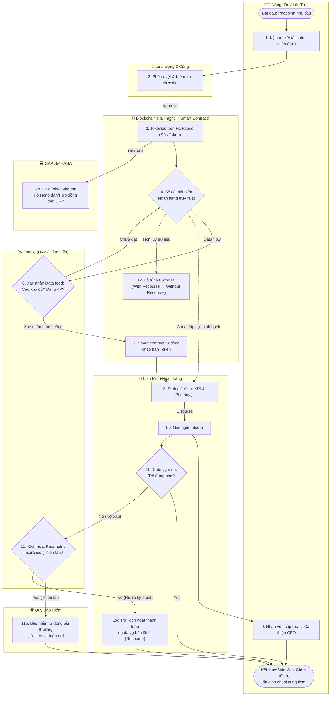

# 🌾 LocTroi AgriChain — Blockchain Supply Chain Finance

LocTroi AgriChain là một nền tảng **Tài trợ chuỗi cung ứng (Supply Chain Finance - SCF)** ứng dụng công nghệ **Blockchain** được thiết kế riêng cho hệ sinh thái nông nghiệp của Tập đoàn Lộc Trời. DApp mô phỏng việc số hóa (Tokenize) khoản phải thu giữa người nông dân và Lộc Trời, biến chúng thành các Tài sản thế giới thực (RWA) nhằm minh bạch hóa dữ liệu, xóa bỏ ghi chép thủ công và tự động hóa quy trình giải ngân thông qua Ngân hàng.

---

## 🗂 1. Cấu trúc Dự án (Project Structure)

Ứng dụng được xây dựng trên React + Tailwind CSS với cấu trúc Component hóa chuẩn mực mô phỏng lại hệ thống Frontend phân quyền của một mạng lưới Consortium Blockchain.

```text
src/
├── App.jsx                  # Root Component: Quản lý Global State (Sổ cái, Users, Roles).
├── index.css                # Style toàn cầu, thiết lập giao diện Full Screen, Tailwind Inject.
├── main.jsx                 # Entry point React.
│
├── components/              # Các UI Components chính:
│   ├── GlobalLogin.jsx      # Quản lý phân quyền 3 cổng: Admin (Lộc Trời) - Bank - Hộ Nông dân.
│   ├── Sidebar.jsx          # Thanh Menu điều hướng Render theo quyền quy định.
│   ├── OverviewTab.jsx      # Dashboard Tổng quan hệ thống (Analytics, Thống kê giải ngân).
│   ├── FarmersTab.jsx       # Ban Lộc Trời: Quản trị các Hộ Nông dân & Xử lý yêu cầu cấp vật tư.
│   ├── InvoicesTab.jsx      # Ban Lộc Trời: Quản lý Khoản phải thu, token hóa lô hàng.
│   ├── FarmerPortalTab.jsx  # Hộ Nông dân: Sổ cái cá nhân, Định danh số, Xác thực rút vốn.
│   ├── SCFTab.jsx           # Ngân hàng: Dành cho Liên minh Ngân hàng định giá & Giải ngân.
│   │
│   ├── SupplyModal.jsx      # Chức năng: Đặt hàng Vật tư nông nghiệp (Hộ Nông dân/Lộc Trời).
│   ├── OracleModal.jsx      # Chức năng: Mô phỏng UAV kiểm tra (Tỉ lệ nảy mầm, SRP chuẩn).
│   ├── DisasterModal.jsx    # Chức năng: Khởi chạy Bảo hiểm & Recourse (Truy đòi khoản nợ).
│   └── LedgerPanel.jsx      # Hiển thị lịch sử các Block (Single Source of Truth).
```

---

## ⚙️ 2. Quy trình & Giai đoạn Hoạt động

Mô hình thiết kế hệ thống giải quyết trọn vẹn điểm nghẽn của SCF Truyền thống nhờ vào việc phân chia rõ 5 giai đoạn liên đới giữa 7 chủ thể/công nghệ khác nhau. Các chủ thể gồm: *Nông dân/Lộc Trời, Lực lượng 3 Cùng, Blockchain (Hyperledger Fabric), Oracle (UAV/IoT), SAP S/4HANA (ERP), Liên minh Ngân hàng, và Bảo hiểm parametric.*

### Trình tự 5 Giai đoạn Cốt lõi:
1. **Giai đoạn Khởi tạo (Origination):** Nông dân và Lộc Trời lập bảng Cam kết tài chính/Yêu cầu vật tư trên hệ thống. 
2. **Giai đoạn Đối soát Thực địa (Verification):** Hệ thống không tin con người. Dữ liệu từ Lực lượng 3 Cùng sẽ gộp với dữ liệu từ Oracle (UAV bay kiểm định Tỉ lệ mầm, độ chuẩn SRP).
3. **Giai đoạn Số hóa tài sản (Tokenization):** Khi Oracle trả về Pass, Smart Contract lập tức nội suy giá trị để đúc thành Token. Đồng thời đồng bộ dữ liệu song song về hệ thống SAP S/4HANA nội bộ.
4. **Giai đoạn Huy động vốn (Financing):** Token được đưa lên SCF Pool. Ngân hàng dựa vào Sổ cái bất biến (lịch sử KPI, mức độ uy tín) để định giá và duyệt giải ngân trong vài Block (2s). Lộc Trời/Hộ Nông dân nhận vốn sớm để xoay vòng CFO.
5. **Giai đoạn Quản trị rủi ro (Risk & Settlement):** 
   - **Win-Win:** Nông dân gặt lúa trả nợ đúng hạn.
   - **Rủi ro:** Khi xảy ra sự cố (thiên tai/nợ xấu), hệ thống có khả năng khoanh vùng rủi ro (Traceback). Smart contract Oracle sẽ bồi thường bảo hiểm ngay lập tức hoặc kích hoạt truy đòi Recourse từ Lộc Trời.

---

## 🌊 3. Lưu đồ Tiến trình (Cross-functional Flowchart)

> Quy trình nghiệp vụ đa nền tảng (BPMN Workflow) mô tả sự di chuyển của dòng chảy tài sản số đi qua các lớp kiểm duyệt từ đồng ruộng đến ngân hàng.




