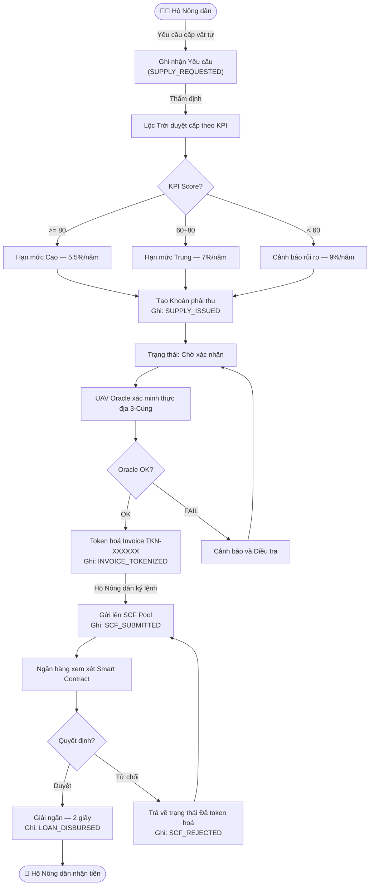
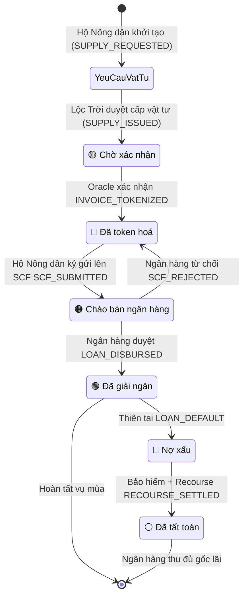
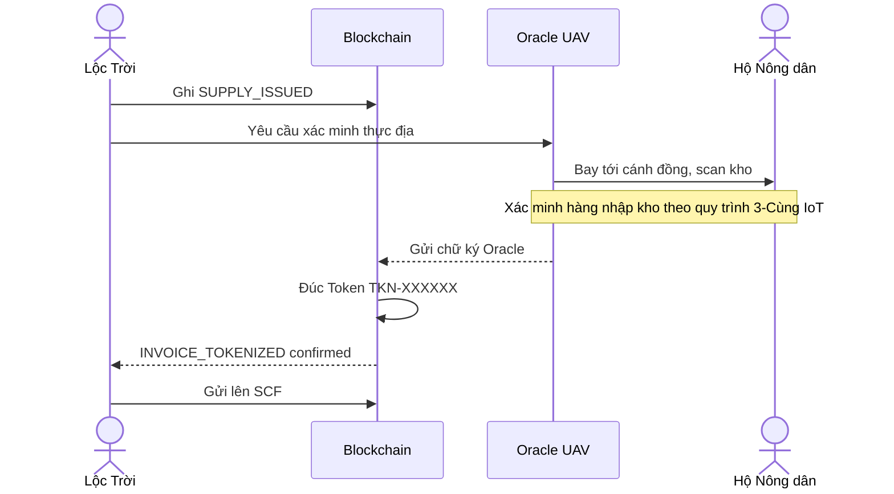
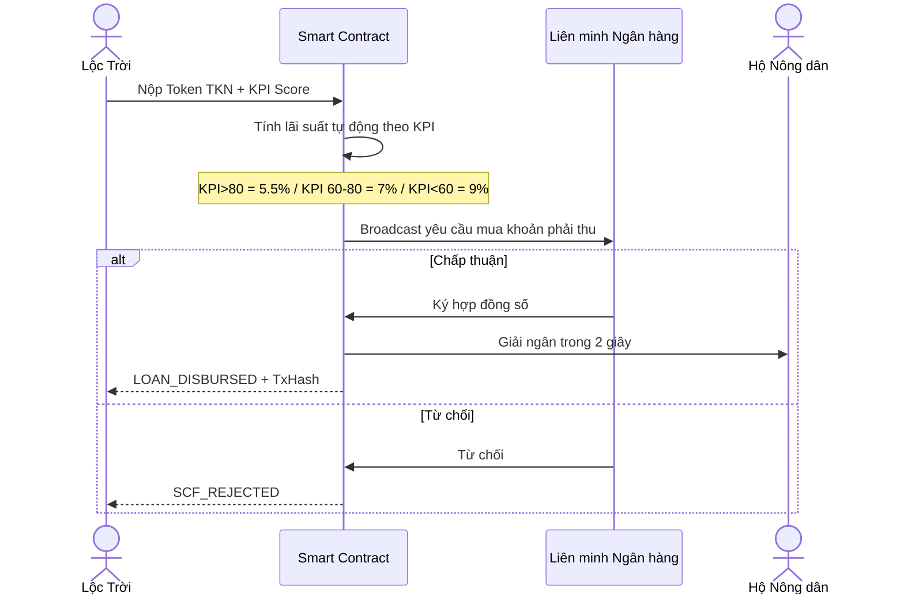
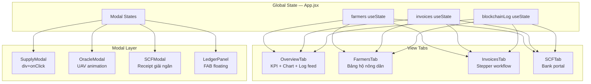

# 🌾 LocTroi AgriChain — Tài liệu Hệ thống

> Nền tảng Blockchain nông nghiệp mô phỏng chuỗi cung ứng lúa gạo, tích hợp tài trợ chuỗi cung ứng (SCF) cho Tập đoàn Lộc Trời.

---

## 🌟 Tầm nhìn & Giá trị cốt lõi

Thách thức lớn nhất trong mô hình nông nghiệp truyền thống là **sự sai lệch dữ liệu trong quá trình thu mua và cấp phát vật tư**. LocTroi AgriChain giải quyết bài toán này bằng việc chuyển đổi từ mô hình quản trị con người và giấy tờ truyền thống sang **mô hình dữ liệu và thuật toán được bảo mật, phân quyền an toàn**.

1. **Digital ID & Sổ cái Hộ Nông dân:** Mỗi thành viên trong Hợp tác xã được cấp một định danh số duy nhất. Mọi giao dịch (nhận giống, phân bón, chốt sản lượng) đều ghi trực tiếp vào "Sổ cái hộ nông dân" trên Blockchain và đối soát chéo với nhật ký thực địa của "Lực lượng 3 Cùng".
2. **Smart Contract Dựa Trên Động lực Kinh tế:** Blockchain cho phép triển khai chính sách khuyến khích chính xác qua các chỉ số KPI: *Tỉ lệ nảy mầm*, *Tuân thủ lịch phun thuốc UAV*, *Độ sạch của lúa*. Đạt chỉ tiêu → Hệ thống tự động cộng điểm thưởng hoặc nâng hạng tín dụng. Máy móc thay thế mệnh lệnh bằng cơ chế tự giác, minh bạch.
3. **Công bằng & Tiêu chuẩn Quốc tế (SRP):** Người nông dân được trả công công bằng dựa trên sức lao động và sự chính xác của dữ liệu, từ đó thúc đẩy sự tự nguyện tuân thủ các tiêu chuẩn quốc tế.
4. **Khoanh vùng rủi ro (Traceability):** Quản lý chuỗi cung ứng thời gian thực với chi phí tối thiểu. Nếu một lô hàng vi phạm tiêu chuẩn, hệ thống lập tức truy xuất ngược (Traceback) vị trí và hộ nông dân thực hiện để xử lý kịp thời, bảo vệ uy tín xuất khẩu của toàn tập đoàn. 

Đây chính là nền tảng để doanh nghiệp nâng cấp xếp hạng tín dụng trên thị trường quốc tế và phát triển bền vững trong kỷ nguyên nông nghiệp số.

---

## 1. Tổng quan kiến trúc

LocTroi AgriChain là **Private DLT (Distributed Ledger Technology)** mô phỏng 4 nghiệp vụ cốt lõi:

| Nghiệp vụ | Tab | Blockchain Action |
|---|---|---|
| Quản lý Hộ Nông dân | Hộ Nông dân & Vật tư | SUPPLY_ISSUED |
| Cấp phát Vật tư | Hộ Nông dân & Vật tư | SUPPLY_ISSUED |
| Token hoá Khoản phải thu | Khoản phải thu | INVOICE_TOKENIZED |
| SCF — Giải ngân Ngân hàng | SCF Ngân hàng | LOAN_DISBURSED |

---

## 2. Luồng nghiệp vụ chính — End-to-End



---

## 3. Trạng thái Invoice — State Machine



---

## 4. Sequence — Oracle UAV Token hoá



---

## 5. Sequence — Smart Contract Giải ngân



---

## 6. Kiến trúc kỹ thuật React



---

## 7. Cấu trúc Block Log

```json
{
  "timestamp": "2025-08-07T14:05:00Z",
  "hash":      "a3f7b2c1",
  "action":    "SUPPLY_ISSUED",
  "data":      "Cấp 100 kg Giống lúa OM5451 cho Nguyễn Văn An (Vụ Hè Thu 2025)"
}
```

| Action | Ghi khi nào | Màu badge |
|---|---|---|
| `GENESIS_BLOCK` | Khởi tạo hệ thống | ⬜ Xám |
| `SUPPLY_REQUESTED`| Hộ Nông dân tự yêu cầu vật tư | 🔵 Indigo |
| `SUPPLY_ISSUED` | Lộc Trời duyệt & cấp phát vật tư | 🟢 Xanh lá |
| `INVOICE_TOKENIZED` | Oracle xác nhận thực địa thành công | 🔵 Xanh cyan |
| `SCF_SUBMITTED` | Hộ Nông dân ký lệnh yêu cầu thanh khoản SCF | 🟠 Cam |
| `LOAN_DISBURSED` | Ngân hàng giải ngân thành công | 🟢 Emerald |
| `SCF_REJECTED` | Ngân hàng từ chối giải ngân | 🔴 Đỏ nhạt |
| `BANK_SYNC` | Đồng bộ lịch sử block thủ công | 🔵 Xanh dương |
| `LOAN_DEFAULT` | Hộ Nông dân khai báo nợ xấu (thiên tai) | 🔴 Đỏ đậm |
| `INSURANCE_TRIGGERED` | Smart contract bảo hiểm kích hoạt | 🟡 Amber |
| `RECOURSE_SETTLED` | Thực hiện nghĩa vụ đền bù Recourse | 🟣 Tím |

---

## 8. So sánh Blockchain vs. Truyền thống

| Tiêu chí | Truyền thống | LocTroi AgriChain |
|---|---|---|
| **Thời gian giải ngân** | 90–120 ngày | ⚡ 2 giây |
| **Xác minh thực địa** | Nhân viên đến tận nơi | 🛸 UAV Oracle tự động |
| **Minh bạch dữ liệu** | Hồ sơ giấy tờ, dễ sai lệch | ⛓️ Immutable Ledger |
| **Token hoá tài sản** | Không hỗ trợ | ✅ RWA Token on-chain |
| **Đa ngân hàng** | Đàm phán từng bên riêng lẻ | 🤝 Smart Contract liên minh |
| **Chấm điểm tín dụng** | Chủ quan, thủ công | 📊 KPI Score tự động hóa |

---

## 9. Dữ liệu mẫu (Mock Data)

### Hộ Nông dân
| ID | Họ tên | Diện tích | KPI | Hạn mức TD |
|---|---|---|---|---|
| #LT-001 | Nguyễn Văn An | 12.5 ha | 85 | 120,000,000 VNĐ |
| #LT-002 | Trần Thị Bích | 6.2 ha | 92 | 80,000,000 VNĐ |
| #LT-003 | Lê Văn Cường | 15.0 ha | 73 | 150,000,000 VNĐ |
| #LT-004 | Phạm Văn Dũng | 2.5 ha | 55 | 40,000,000 VNĐ |
| #LT-005 | Hoàng Thị Em | 8.8 ha | 88 | 95,000,000 VNĐ |

### Vật tư
| ID | Tên | Đơn vị | Đơn giá |
|---|---|---|---|
| S001 | Giống lúa OM5451 | kg | 45,000 VNĐ |
| S002 | Phân bón NPK 20-20-15 | kg | 12,000 VNĐ |
| S003 | Thuốc BVTV sinh học | chai | 85,000 VNĐ |

> **Giá lúa thị trường:** 8,500 VNĐ/kg

---

> **Lưu ý triển khai thực tế:** Đây là bản mô phỏng client-side với React `useState`. Để đưa vào sản xuất, cần kết nối **Hyperledger Fabric** hoặc **Ethereum Private Chain**, và Oracle UAV tích hợp **IoT Gateway** thực trên đồng ruộng Lộc Trời.
